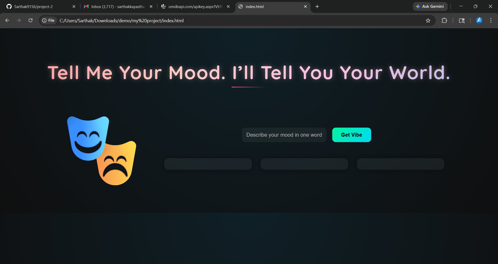

 Let Me Tell You

A mood-based recommendation system that suggests movies, songs, and books based on user emotions.

 Features

* Mood-based recommendations
* Dynamic UI with emojis and glow effects
* REST API integration using Spring Boot
* MySQL database connectivity

## 🛠 Tech Stack

* Java (Spring Boot)
* MySQL
* HTML, CSS, JavaScript

 How It Works

User enters a mood → Backend processes it → Returns personalized recommendations → UI displays results attractively.

 Future Improvements

* AI-based sentiment analysis
* Movie poster integration (OMDb API)
* User authentication system

 Preview

